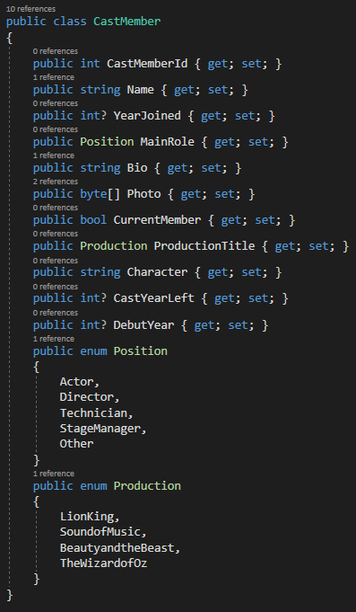
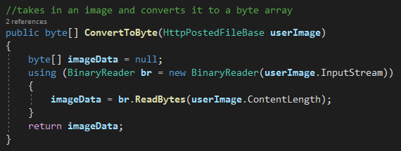
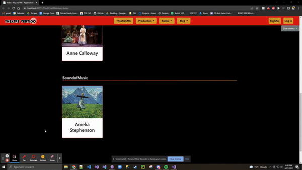
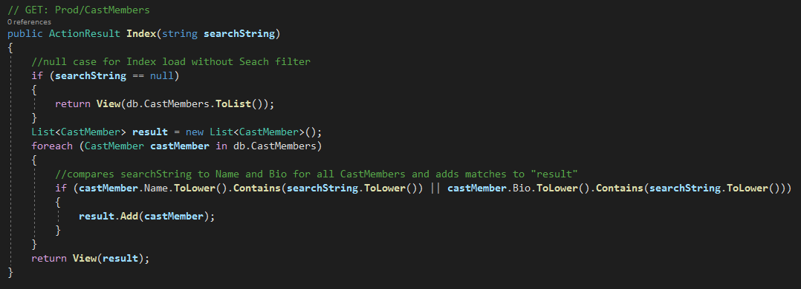

#  [Vertigo Theatre](https://github.com/jeremydelain/C-Sharp_Projects/tree/main/VertigoTheatre)
  

  This project is the most substantial thing I've produced while learning at The Tech Academy. I am very proud of the results and I enjoyed imporving my skills in:
  * C#
  * .Net Framework
  * Entity Framework
  * MVC structured solutions
  * CSS
  * Bootstrap
  * Azure DevOps
  * Version control
  
  I was a part of the team working on the "Production" section of the website where I used Entity Framework to scaffold my CRUD pages for my CastMember model.
  
  
  
  The create page is a simple form with a file selector for a profile picture.
  
  
  
  The selected image is turned into a byte array for storage.
  
  
  
  The Edit page looks almost the same and updates the CastMember entity when submitted.
  
  The Index page is organized by headers sorted by the "ProdutionTitle" property, representing the show cast members are working on. CastMembers are represented as Bootstrap cards in wrapping rows with each card displaying their profile picture and name. Clicking on the card brings you to their details, hovering displays the edit and delete buttons.
  
  
  
  The Index page includes a search/filter feature. Users can reload the page, filtering for a match in the CastMember's name or bio.
  
  
  
  The filtering occurs in the Controller, in the Index method.
  
  
  
  The delete icons brings you to a delete page to confirm before deleteing.
  
  
